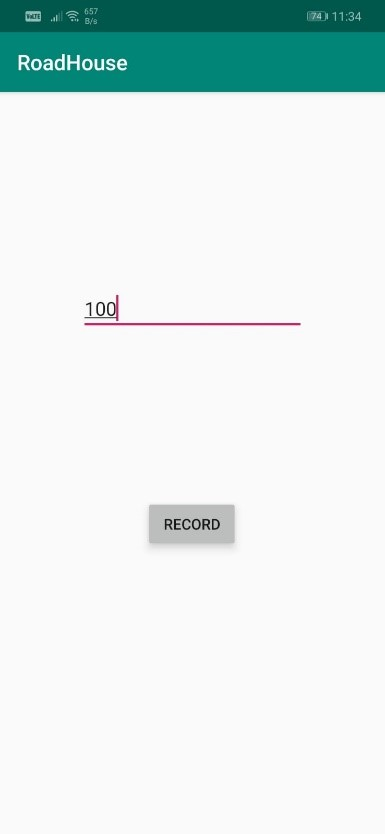
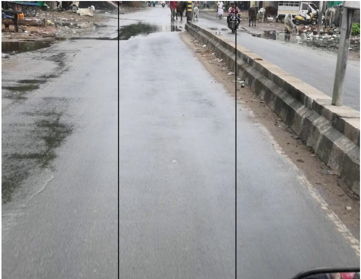
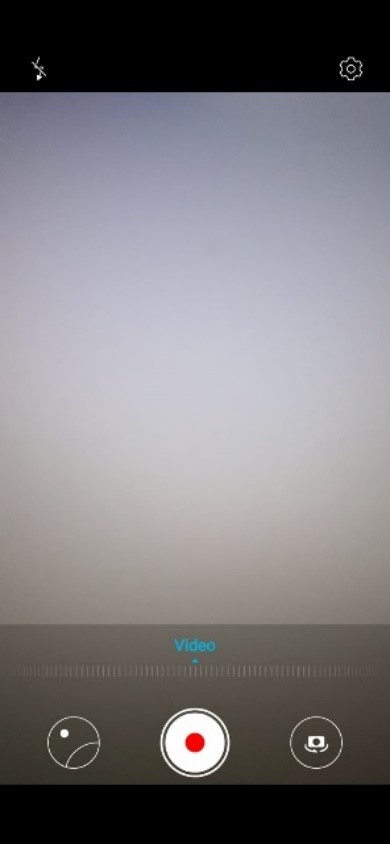

# RoadHouse
Input app for Project Road Analyser System find at 
:https://github.com/rajputchintan22/Road-Analyzer-System

# Purpose 
We built up an android application which could capture video and locations  simultaneously, we additionally gave the usefulness of client characterized time interval for location refreshing, which would give user the opportunity to choose the coordinates per second which are to be logged in coordinates.txt record. We used phones default camera application so client can benefit by software defined image stabilization and other features of her/his smart phones camera app.

As shown in the figure the app will contain one input line and one record button. User needs to enter the time interval for location refresh in ms. After which user will press the record button which will take user to next page of which is camera app as soon as user hits the record on that camera app it will start recording video and location. After finishing the video app will ask user to save the video on doing that user will save video and location file into phone’s local memory. The Video is in mp4 format and location log is in txt format

Figure : Input App

# Video Capturing 
Now we take those input files and offer it to one python program which will partition the video into wanted number of frames entered by user, here it is significant that we notice that the quantity of frames for second ought to be same as the quantity of location caught by input app. 

As the roads in India doesn't have characterized outskirt, we separate each picture into further three sections left, right and center so it enables us to see whether the road is completely damaged or just partially damaged.

Figure : Record Mode

# Image Processing 

This would help in notifying end users to keep left or keep right as the road forward is partially damaged, and could also help government in prioritizing the repair work of roads.

These individual frames are now given to our classifier which would classify each frame and log them into the CSV files then that csv files are processed  to generate frame wise output in which each column of csv file represents following things : frame no, left frame condition, center frame condition, right frame condition and type. The type is combination of output for all these three frames , so if only left or right of road is damages then type is -2 or 2 meaning partial damage if whole road is good that means the type is 0 is center of both the sides or all three sides are classified as bad road then the road is bad road type is 1.

Figure : Dividing each frame into three parts

# For Classification and results go to: https://github.com/rajputchintan22/Road-Analyzer-System
